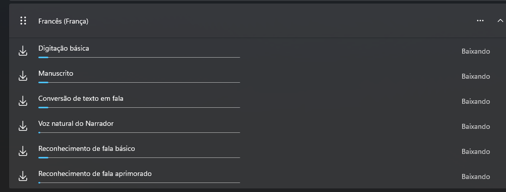

# Installing Better Speech Synthesis Voices (macOS, Windows, Linux)

Modern browsers use your operating system's installed voices for the Web Speech API (`SpeechSynthesisUtterance`).

Installing additional language packs and enhanced voices can dramatically improve pronunciation quality for languages like:

* French
* Czech
* German
* Japanese
* Portuguese
* Spanish

---

# macOS

## Install Additional Voices

1. Open **System Settings**
2. Go to:

```txt
Accessibility → Spoken Content
```

3. Click:

```txt
System Voice
```

4. Select:

```txt
Manage Voices...
```

5. Download the languages you want:

   * French
   * Czech
   * etc.

6. Prefer:

   * Enhanced
   * Premium
   * Neural
     voices when available.

---

## Recommended Voices

### French

* Thomas
* Amélie

### Czech

* Zuzana

---

## Test Installed Voices

Open browser console:

```js
speechSynthesis.getVoices()
```

You should see entries like:

```js
{
  lang: "fr-FR",
  name: "Amélie"
}
```

---
# Windows 11

## Install Speech Voices

1. Open:

```txt
Settings
```

2. Go to:

```txt
Time & Language → Speech
```

3. Click:

```txt
Add language
```

4. Install French (France), Czech (Czech Republic) or some desired language.



5. Restart your browser afterward.

---

## Verify Voices

Open browser console:

```js
speechSynthesis.getVoices()
```

---

# Linux (Ubuntu)

Linux support varies depending on:

* Browser
* Desktop environment
* Installed speech engines

The best setup usually uses:

* Speech Dispatcher
* eSpeak NG
* RHVoice

---

## Install Basic Speech Packages

Ubuntu/Debian:

```bash
sudo apt update

sudo apt install \
speech-dispatcher \
espeak-ng \
speech-dispatcher-espeak-ng
```

---

## Install Additional Languages

Example for French/Czech support:

```bash
sudo apt install \
espeak-ng-data
```

---

## Restart Browser

After installation:

```bash
killall chrome
```

or restart Firefox/Chrome manually.

---

# React Voice Selection Example

## List Available Voices

```ts
const voices = speechSynthesis.getVoices()

console.log(voices)
```

---

## Handle Async Voice Loading

Some browsers load voices asynchronously:

```ts
speechSynthesis.onvoiceschanged = () => {
  const voices = speechSynthesis.getVoices()

  console.log(voices)
}
```

---

## Select Specific Language Voice

```ts
const utterance = new SpeechSynthesisUtterance(text)

const voices = speechSynthesis.getVoices()

const frenchVoice = voices.find(
  (voice) => voice.lang === "fr-FR"
)

if (frenchVoice) {
  utterance.voice = frenchVoice
}

speechSynthesis.speak(utterance)
```

---

# Recommended Production Strategy

## MVP

Use browser speech synthesis:

```ts
SpeechSynthesisUtterance
```

Advantages:

* Free
* Instant
* Offline capable
* Easy integration

---

## Production Upgrade

For higher quality pronunciation:

* Google Cloud TTS
* Azure Speech
* ElevenLabs
* Amazon Polly

Most professional language-learning apps eventually:

* pre-generate audio files
* cache pronunciation
* use neural voices
* stream audio instead of browser TTS

---

# Important Notes

## Voice Quality Depends On

* Operating system
* Installed voice packs
* Browser
* Device hardware

---

## Browser Differences

### Usually Best

* Safari (macOS/iPhone)
* Edge (Windows)

### Mixed

* Chrome
* Firefox

---

# Useful Debugging Snippet

```ts
speechSynthesis.onvoiceschanged = () => {
  const voices = speechSynthesis.getVoices()

  voices.forEach((voice) => {
    console.log(
      `${voice.name} | ${voice.lang}`
    )
  })
}
```

This helps identify:

* installed languages
* available neural voices
* exact language codes
* browser-supported voices

```
```
